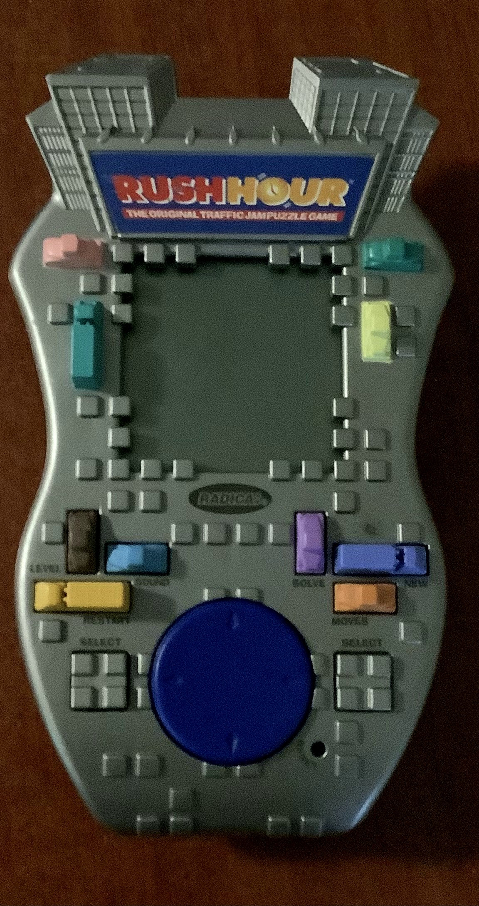
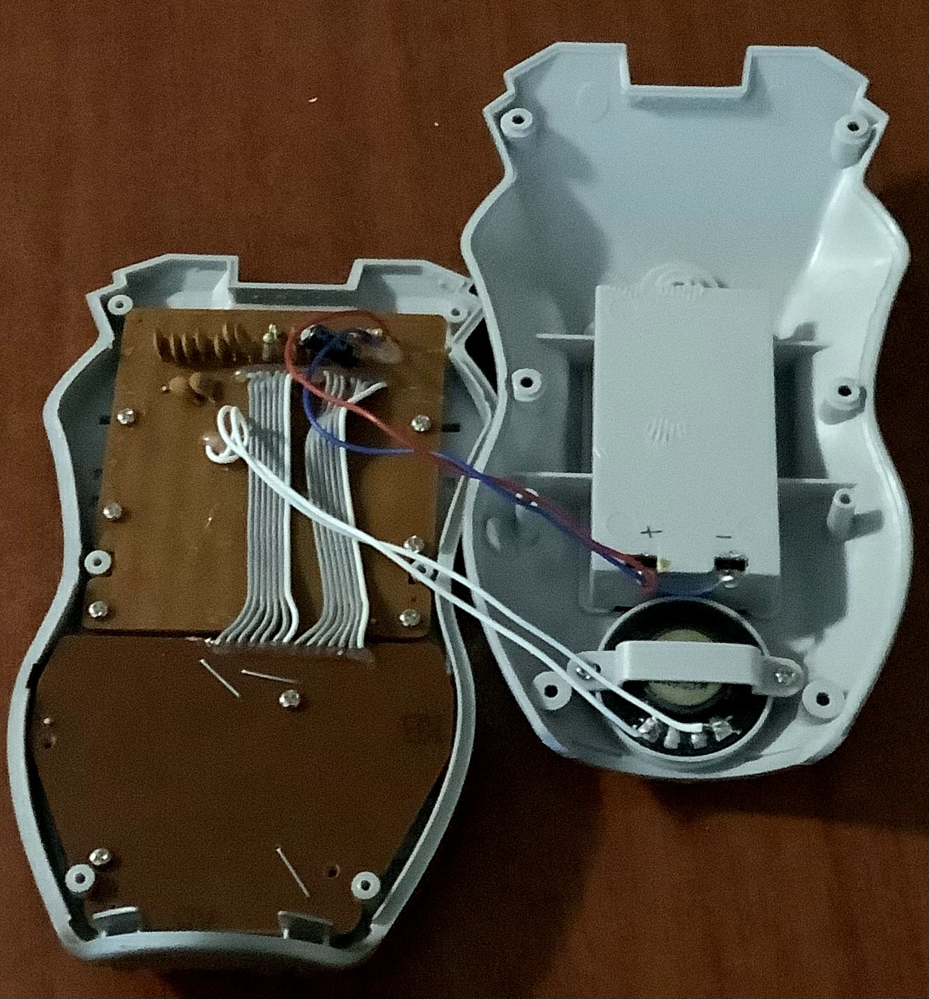
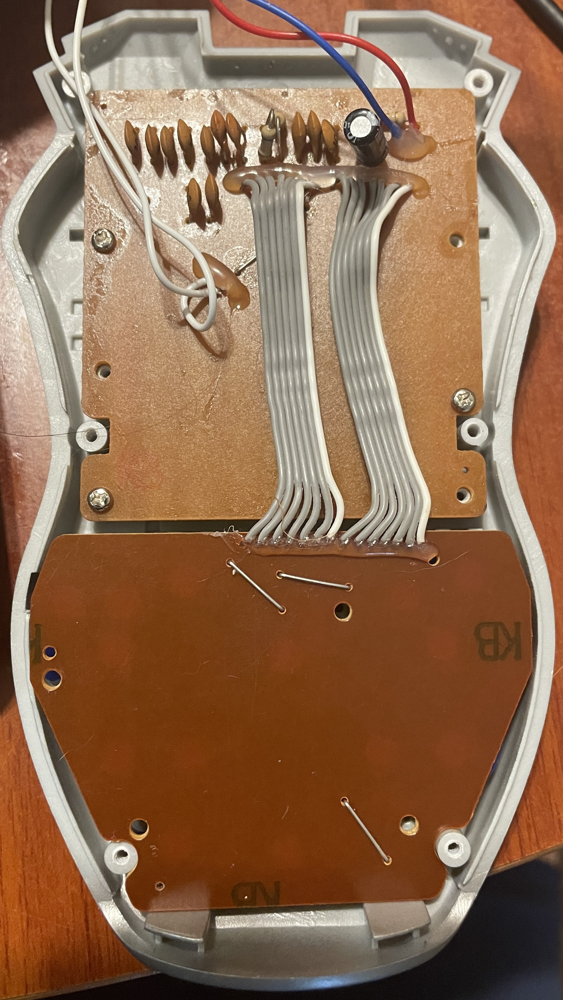
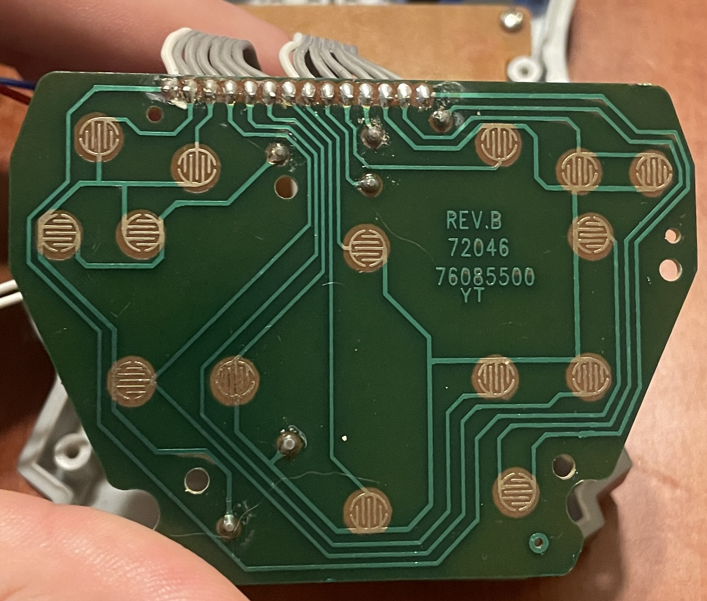
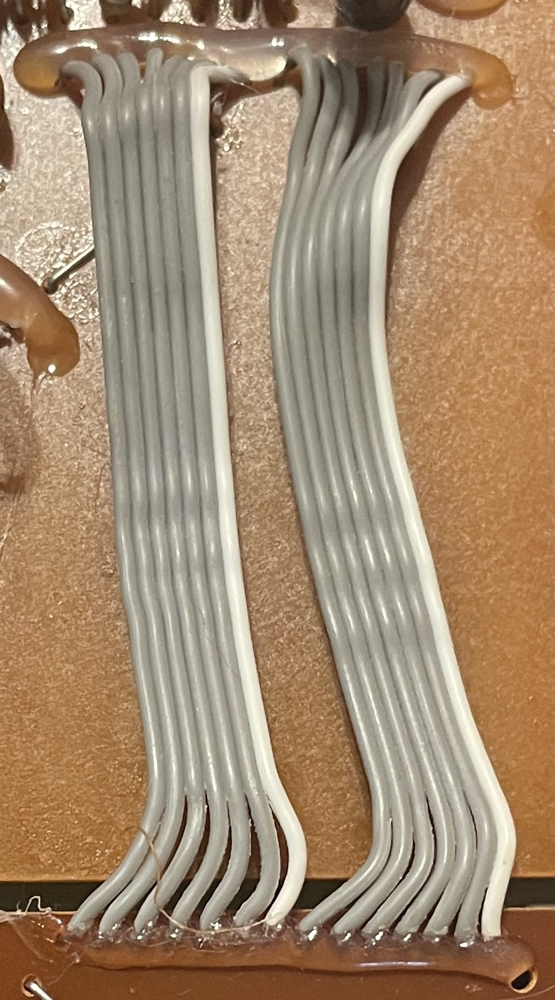
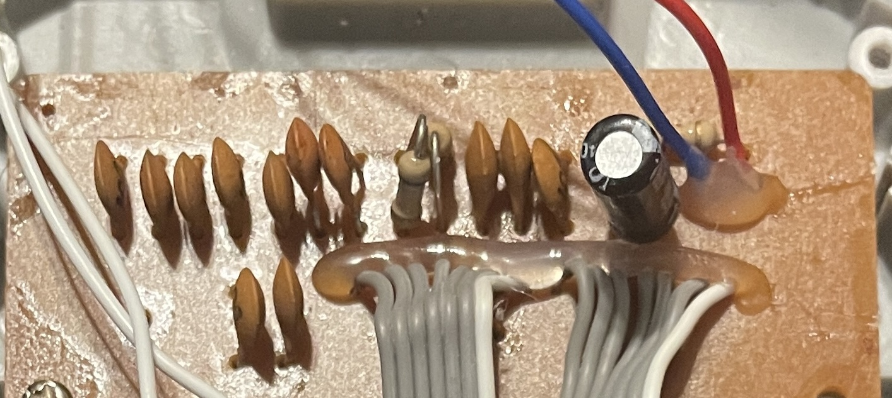
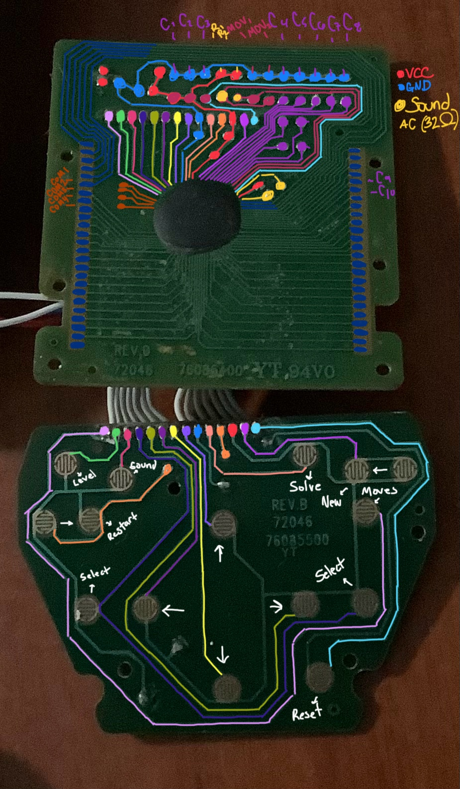

# Rush Hour Console Reverse Engineering

This is my first documented project on my process of reverse engineering a retro game console. I 
document my entire process from tracing the PCB to wiring it to a logic analyzer, finally trying to 
add my own components ( sort of this is a draft idk what the end goal is )  

  
  

## Playing the Game

## Hardware Overview

This section documents the internal components of the console.

### Physical Design

- Inside of a plastic handheld case.
- Black and whtite LCD display.
- Speaker on the back.
- Operates using two AA batteries.

### Internal Components

- **Main PCB** contains a chip-on-board (COB).
- **LCD display** powered with horizontal zerba stripe connections.
- **Speaker** wired to audio output.
- **Buttons PCB**  

- **Buttons** connected with ribbon cable.  

- **Power section** includes:  

    - 10 microfarad electrolytic capacitor (smoothing).
    - 0.1 microfarad ceramic caps (104) (decoupling).
    - Two metal oxide varistor (MOVs) for surge protection.
    - Various resistors.

## Circuit Schematics

The whole circuit consists of two PCBs. There is one PCB that houses COB that controlls the main game logic. The
other PCB controlls the button map connected through a 14 wire wide ribbon cable. This cable connects a VCC, GND, ans 12 button terminals.  

The main circuit consists of X number of connections to the COB, the number of connections include:
- Various connections from capacitors.
- 12 button connections.
- Y LCD connections.
- Two sound connections.
- Four COM connections.

This is the pirmary circuit. It has everything it needs for speaker output, reliable buttons, consistent voltage, and a compact monocrome
display.

## Logic Analyzer

A logic analyzer is very hard to do woth this circuit because there are no microchips to connect to their pins and the gold tabs are very close together i do not have the tools to solder wires to them and analyze the output. 

## What I Learned

Where the COM pins were located because the multimeter averages volatages so I could tell that when an icon was blinking 
it would turn the voltage from high to low averaging out in the middle. I saw this on one of the COM pins when it was in an off
state verse on and located the COM pins.

That all the connections to the COB are not just for both input and output there are a lot of pins connected to capacitors to
keep a constant voltage and have less spikes.

The Buttons have one connection to VCC and GND and their ribbon cable. once the button is pressed it completes the circuit.
It is very simple and makes sense just it was my first time tracing it andexeriencing it in front of me so it was really cool.

I was shocked at how simple the whole system was. I understand that this game was made in the early 2000s and it was made to be
cheap but the system is surpisingly small. I don't know what I was expexting but there is just buttons; one wire for each button,
connections for consisten, smooth, voltage throughout the system, two speaker connections, and a lot of connectons of the LCD. That
is the entire circuit and all the hardware it takes to create a fun, small game.
